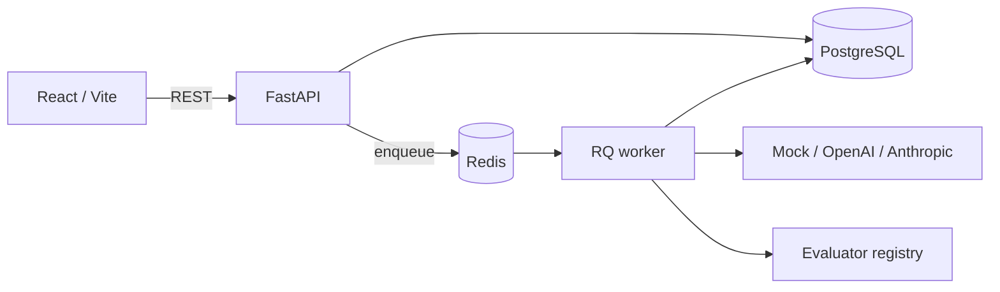

# EvalForge

**Repeatable LLM evaluations with inspectable results.** EvalForge is a local-first workspace for testing prompt versions and model configurations against structured datasets. It records every output, evaluator score, latency, token count, and configured cost estimate, then shows how two runs differ case by case.

The full workflow runs with a deterministic mock provider. OpenAI and Anthropic adapters use environment credentials when you choose to evaluate real models.

## Demo and screenshots

After starting the stack, open [http://localhost:3000](http://localhost:3000). The optional seed command adds three small datasets, matching prompts, and a deterministic mock configuration:

```bash
docker compose exec api python -m app.seed
```

It creates **no historical runs**. Start a run in the UI to generate real local results from the mock adapter. For the JSON extraction dataset, select JSON validity and JSON schema evaluators.

Screenshots from an actual session can be added to [`docs/screenshots/`](docs/screenshots/). No simulated results or screenshots are included.

## Why EvalForge?

Model outputs are easier to reason about when the input set, prompt version, evaluator settings, and provider configuration are recorded together. EvalForge keeps that experiment record, including failures, so a changed prompt or model can be compared against a previous run without relying on memory or a one-off spreadsheet.

## Features

- Datasets with JSON inputs and expected outputs, per-case metadata, and JSON or JSONL bulk import.
- Immutable prompt versions with variable rendering and a sample preview.
- Deterministic mock, OpenAI, and Anthropic providers behind one generation interface.
- Background evaluations through Redis Queue with configurable request concurrency and per-case error records.
- Exact match, contains, JSON validity, JSON Schema, and similarity evaluators.
- Run summaries with mean, median, P50, P95, min, and max where applicable; tokens, latency, estimated cost, and failed requests.
- Side-by-side run comparison with score deltas, regressions, and improvements over shared test cases.
- FastAPI OpenAPI documentation and a responsive React workspace.

## Architecture



The API validates and records a pending run, then places its ID on the queue. A worker loads the frozen prompt version and provider configuration, runs cases with a semaphore, persists results as they finish, and marks the run complete. The UI polls while the run is pending or active. Each test case captures its rendered prompt and input snapshot for inspection.

## Quick start

Requirements: Docker Engine with Compose. From a clone of this repository:

```bash
cp .env.example .env
docker compose up --build
```

On PowerShell, copy the file with `Copy-Item .env.example .env`. Then open:

- Workspace: [http://localhost:3000](http://localhost:3000)
- API docs: [http://localhost:8000/docs](http://localhost:8000/docs)
- Health endpoint: [http://localhost:8000/health](http://localhost:8000/health)

To try the workflow without credentials, create a dataset and test cases, create a prompt with `{{input}}`, add a Mock provider, and start an evaluation. By default the mock returns the rendered prompt. Set a **default mock response** or supply an advanced `mock_responses` JSON map from exact rendered prompts to outputs for deterministic scoring. The seed command provides ready-made examples.

For a real provider, set `OPENAI_API_KEY` or `ANTHROPIC_API_KEY` in `.env`, restart the API and worker, then add a configuration with that provider type and a model name. Keys stay in process environment; the database stores only non-secret configuration. Configure both input and output price per million tokens if you want cost estimates. Without both prices, cost is shown as unknown.

## Example

Create a dataset using the UI or API:

```json
[
  {"input": "What is the capital of Canada?", "expected_output": "Ottawa"},
  {"input": "What is the capital of France?", "expected_output": "Paris"}
]
```

Prompt template:

```text
Answer the following question concisely:

{{input}}
```

A run binds **one dataset, one prompt version, one provider configuration, and one or more evaluator specifications**. Run the same dataset again with a different version or provider, then choose both completed runs in **Compare runs**.

## Evaluation system

| Evaluator | Behavior | Configuration |
| --- | --- | --- |
| `exact_match` | 1 for equal values, otherwise 0 | `case_sensitive`, `normalize_whitespace` for strings |
| `contains` | 1 when the expected string occurs in the output | `case_sensitive` |
| `json_validity` | 1 when output parses as JSON | None |
| `json_schema` | 1 when output validates against `metadata.json_schema` | None |
| `semantic_similarity` | Token Jaccard overlap by default; optional local sentence embeddings | `method: token_jaccard` or `local_embeddings` |

The default similarity method is a **lexical proxy**, not a claim of semantic equivalence. For local embedding similarity, install the `semantic` Python extra in the worker image or local environment and set `{"method":"local_embeddings"}` in the run API request. That method loads `all-MiniLM-L6-v2` on first use and may download model weights. It has no paid API dependency. The standard Docker image intentionally stays lightweight and uses token overlap.

Each result's score is the arithmetic mean of its configured evaluator scores. The run's mean score uses scored results; pass rate is the share of scored results with a score of 1. Failed provider requests are counted separately and have no evaluator score. Percentiles use linear interpolation between sorted observations, including for small samples. Cost estimates use configured prices and provider-reported tokens; the mock uses whitespace token estimates and marks that method in provider metadata. If any result lacks a cost estimate, the run total is unknown.

Comparison deltas are **run B minus run A**. Runs must share a dataset and evaluator settings. Their case counts are shown because the dataset may have gained cases between runs; case regressions and improvements use cases present and scored in both. A provider failure without a score is visible in the failure count and case detail, rather than being mislabeled as a score regression. Measurements do not declare either model objectively better.

## API

FastAPI serves interactive documentation at `/docs` and an OpenAPI document at `/openapi.json`. Core endpoints:

```text
GET    /dashboard
GET    /datasets                     POST /datasets
GET    /datasets/{id}                DELETE /datasets/{id}
POST   /datasets/{id}/test-cases     POST /datasets/{id}/import
DELETE /test-cases/{id}
GET    /prompts                      POST /prompts
GET    /prompts/{id}                 POST /prompts/{id}/versions
POST   /prompt-versions/{id}/preview
GET    /providers                    POST /providers
GET    /runs                         POST /runs
GET    /runs/{id}                    GET /runs/{id}/results
POST   /runs/{id}/cancel
GET    /comparisons?run_a=...&run_b=...
GET    /health
```

Example run request:

```json
{
  "name": "Mock baseline",
  "dataset_id": "<dataset UUID>",
  "prompt_version_id": "<version UUID>",
  "provider_configuration_id": "<provider UUID>",
  "evaluators": [{"type": "exact_match", "config": {"case_sensitive": false}}]
}
```

## Development

The Compose stack is the easiest development environment. For host-side work, use Python 3.12+, Node 22+, a PostgreSQL database, and Redis. Set `DATABASE_URL` and `REDIS_URL` to those host services; the `.env.example` values use Compose service names.

```bash
cd apps/api
uv sync --extra dev
uv run alembic upgrade head
uv run uvicorn app.main:app --reload
```

In separate terminals, run `uv run python -m app.worker` from `apps/api` and `npm ci && npm run dev` from `apps/web`. Vite proxies `/api` to `http://localhost:8000` by default. If developing the frontend against a different API, set `VITE_API_PROXY_TARGET`.

The seed command is idempotent for its named datasets and provider. It does not replace existing data. Database schema changes use Alembic revisions in `apps/api/migrations/versions`.

## Testing and checks

```bash
cd apps/api
uv sync --extra dev
uv run pytest -q
uv run ruff check app tests migrations
uv run ruff format --check app tests migrations
uv run alembic check

cd ../web
npm ci
npm run typecheck
npm run lint
npm run test
npm run format:check
npm run build
```

Backend tests use SQLite in memory, an in-memory Redis substitute, and the deterministic mock, so no paid API or external services are needed. CI runs backend tests and lint, a migration upgrade, and frontend tests, typecheck, lint, and build on pushes and pull requests. The Compose deployment supplies PostgreSQL and Redis; CI does not exercise live provider accounts.

## Project structure

```text
apps/api/       FastAPI routes, services, SQLAlchemy models, evaluators, providers, worker, migrations
apps/web/       React/Vite workspace
docs/           Screenshot guidance
.github/        CI workflow
docker-compose.yml
```

## Scope and roadmap

V1 is a single-user local workspace. It has no login, team permissions, hosted billing, or distributed tracing. Queued cancellation marks the run cancelled; an in-flight provider call may finish before the worker observes it. A worker interrupted at the process level can leave a run marked running until manually investigated. Future work could add interrupted-job recovery, dataset revision history, more evaluator methods, and a small SDK.

## Contributing

Issues and focused pull requests are welcome. Include a test for behavior changes, keep provider credentials out of fixtures and logs, and run the checks above before submitting. Please describe any evaluator scoring change and its effect on comparisons.

## License

MIT — see [LICENSE](LICENSE).
